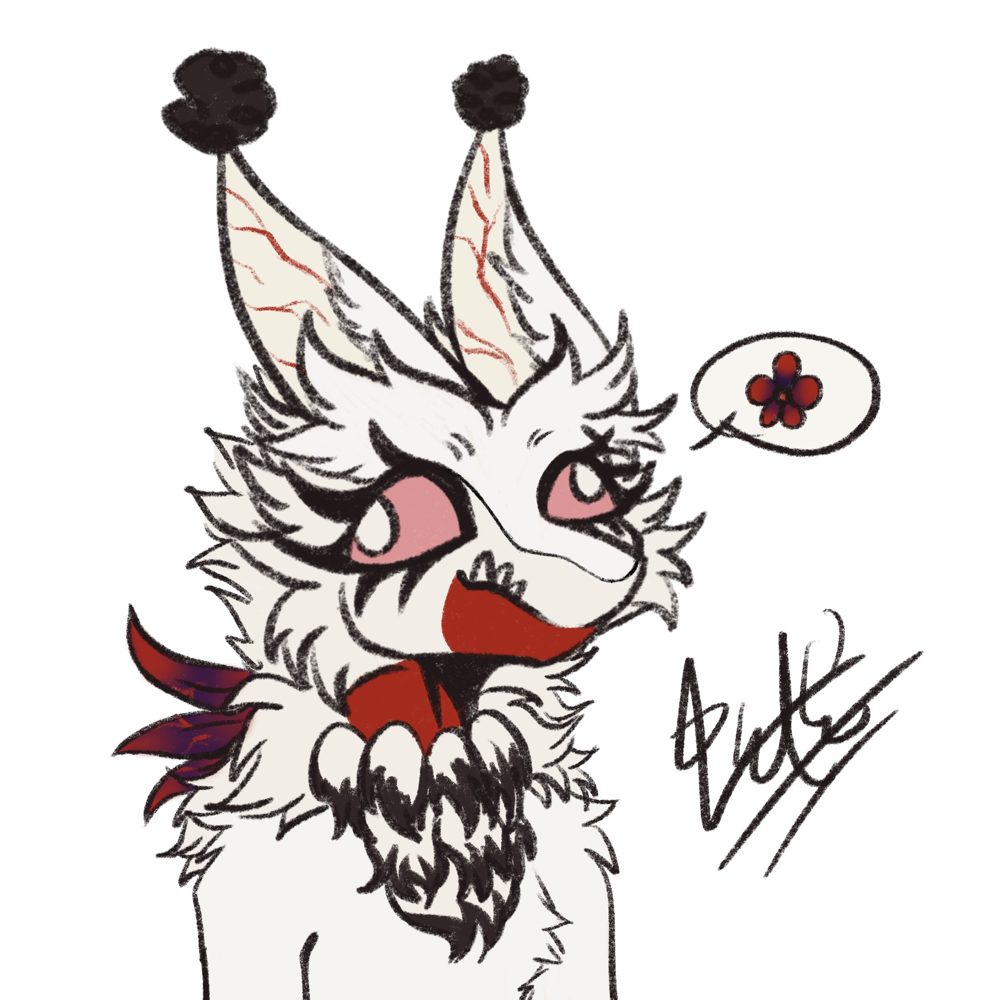

  
  <h1 align="center">AoandonBot</h1>

  
  
  
  

---
## AoandonBot By Somiona

> 'Aoandon the guidance, glimpse from the side of Sanzu River'

Message relay service for non-bukkit/spigot Minecraft server such as Fabric and Forge. Messages from Minecraft are handled by  [MCDR](https://github.com/Fallen-Breath/MCDReforged), and route to server powered by [Koishi.js](https://github.com/koishijs/koishi). Message sync between Mineraft, QQ, Kook, Discord and many other popular IMs.

---

### In-house Plugins

#### Koishi-Plugin-Adapter-MCDR

  
  

Koishi Adapter, Link to MCDReforged server Message Bridge.

### Credit

[Aoandon Avatar](./doc/assets/Aoandon.jpg): Author [苏雅忆](https://twitter.com/syy_vitali)
Above-mentioned 'Aoandon' is the proprietary original furry character of [ChefeIrkka](https://twitter.com/ChefeIrkka), visual designed by 鼠球. NOT to be confused with the character from Hyakki Nocturnal.

---
## 幽灯Bot By Somiona

> "引路幽灯·遥望彼岸"

用于无 bukkit/spigot 插件端 (如原版、Fabric、高版本Forge服) Minecraft 服务器的多功能机器人，基于 [MCDR](https://github.com/Fallen-Breath/MCDReforged) 实现从 Minecraft 获取信息，并由 [Koishi.js](https://github.com/koishijs/koishi) 转发/同步到 QQ、Kook 等平台

---
### （待）实现功能
+ [ ] 服务器管理
  + [ ] MC服务器在线信息查询（内存占用，版本，在线玩家）
  + [ ] 获取服务器启用插件列表
  + [ ] 开启/关闭服务器白名单
  + [ ] 添加/移除服务器管理员
  + [ ] MC玩家ID绑定聊天工具账号
+ [ ] 消息转发
  + [ ] 群组服务器分频道监听
  + [ ] MC服务器与Kook/Discord分频道转发
  + [ ] MC服务器和QQ双向转发
  + [ ] 入服/离服事件QQ群播报
  + [ ] 玩家聊天消息监听，支持自定词条自动回复
+ [ ] 指令功能
  + [ ] 赞助者权限相关功能
  + [ ] 在线/离线玩家信息查询
  + [ ] 群成员自助申请白名单
  + [ ] 在QQ群执行MC指令
+ [ ] 自定义广播消息

### 内置插件

#### Koishi-Plugin-Adapter-MCDR

  
  

Koishi 消息适配器，作为 Client 连接到 MCDR 加载的 Message Bridge 插件

### 版权

[Aoandon头像](./doc/assets/Aoandon.jpg) 作者 [苏雅忆](https://twitter.com/syy_vitali)
幽灯 为 [ChefeIrkka](https://twitter.com/ChefeIrkka) 的私有版权角色，视觉设定作者为鼠球。
